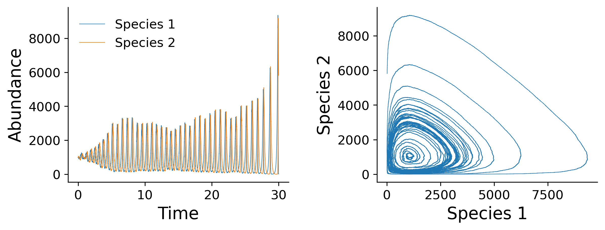
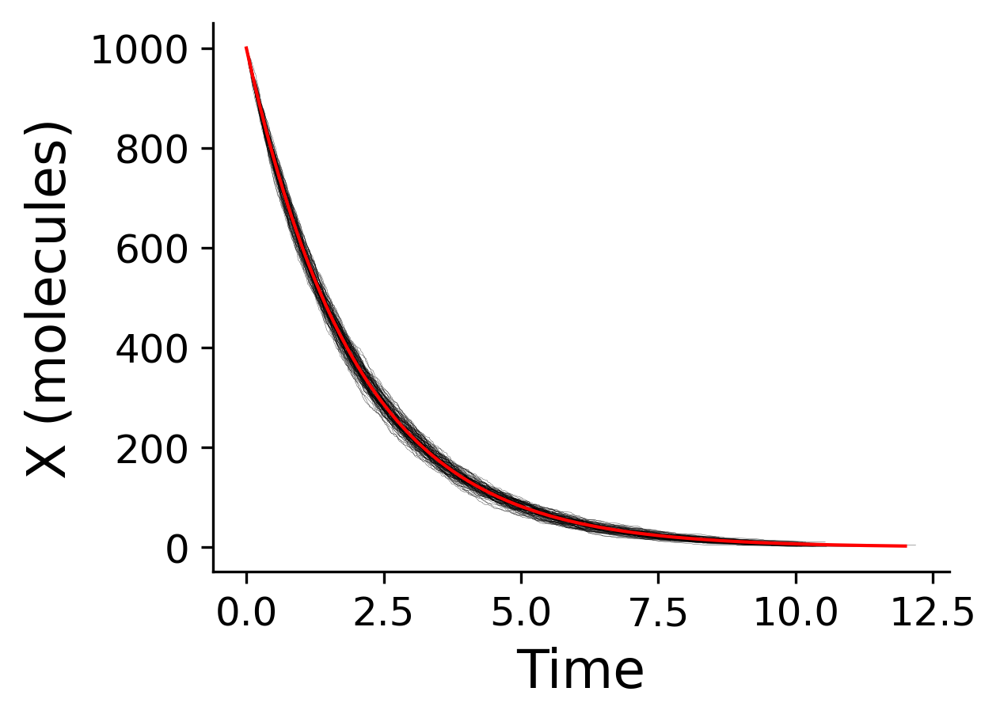

# gillespy

A Python module for stochastic kinetic modeling implemented in Rust.

The algorithm is described by Gillespie, DT (1977) [[1]](#1), and is useful for
modeling complex kinetic processes where a deterministic solution would be
difficult to calculate.

## Usage

To simulate a kinetic process, define the initial number of species `y`, the
rate constants `c`, and the change in the number of species for each reaction
`update_y` as python lists.

Then, define a function `func` that takes the current number of species and
returns the number of distinct species combinations available at the time.
This function is passed as a parameter, along with the duration of the simulation,
`stop_time`.

Calling the `gillespie` function then returns a possible outcome for the process:

```python
from gillespy import gillespie

t, species = gillespie(y, c, update_y, func, stop_time)
```

## Examples

### The Lotka Reactions

The Lotka reactions are a set of autocatalytic reactions, similar to a simple
predator-prey model:

$$
\bar{X} + Y_{1} \xrightarrow{c_{1}} 2Y_{1}
$$

$$
Y_{1} + Y_{2} \xrightarrow{c_{2}} 2Y_{2}
$$

$$
Y_{2} \xrightarrow{c_{3}} Z
$$

This set of equations can be interpreted as a food source, $\bar{X}$, helps a
prey species $Y_{1}$ replicate. A predator $Y_{2}$ replicates by feeding on
prey, and predators die at some rate.

Assuming the amount $\bar{X}$ is constant, it can incorporated into the rate
constant (e.g., $c_{1} \bar{X}$). Then, the dynamics of $Y_{1}$, $Y_{2}$ = 1000
can be modeled with $c_{1} \bar{X}$ = 10, $c_{2}$ = 0.01, and $c_{3}$ = 10 as
follows:

```python
from typing import List
from gillespy import gillespie


def lotka(y: List[int]) -> List[float]:
    """
    Pr(rxn1) ~ X * Y1, but X is in the rate constant
    Pr(rxn2) ~ Y1 * Y2
    Pr(rxn3) ~ Y2
    """
    return [y[0], y[0] * y[1], y[1]]


y = [1000, 1000]
c = [10, 0.01, 10]
update_y = [
    [ 1,  0],  # Eating food increases Y1, no effect of Y2
    [-1,  1],  # Predator eating prey decreases Y1, increases Y2
    [ 0, -1]   # Predator dying decreases Y2
]
stop_time = 30

t, species = gillespie(y, c, update_y, lotka, stop_time)
```

The simulation produces the following output, one of many possible outcomes.



### First-order reactions

A simpler example is a first-order reaction

$$
X \xrightarrow{c} Z
$$

given by the rate equation

$$
\frac{dX}{dt} = -cX
$$

whose solution at $t$ = 0 is

$$
X(t) = X_{0}e^{-ct}
$$

Stochastic simulation of this process can be modeled for $X_{0}$ = 1000 and $c$
= 0.5 as follows:

```python
from gillespy import gillespie

def decay(y):
    return y

t, yt = gillespie([1000], [0.5], [[-1]], decay, 10)
```

Plotting 100 simulations of this stochastic process against the deterministic
solution produces the following output:



### More examples

See the [ipython notebook](example.ipynb) for more examples.

## References

<a id="1">[1]</a> Gillespie, DT. Exact stochastic simulation of coupled
chemical reactions. _J. Phys. Chem._ **1977**, 81, _25_, 2340–2350.
